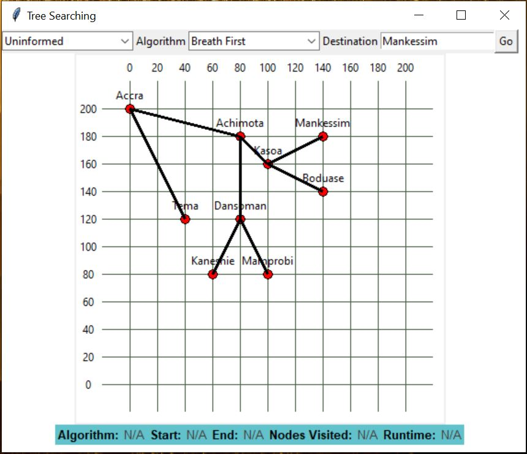
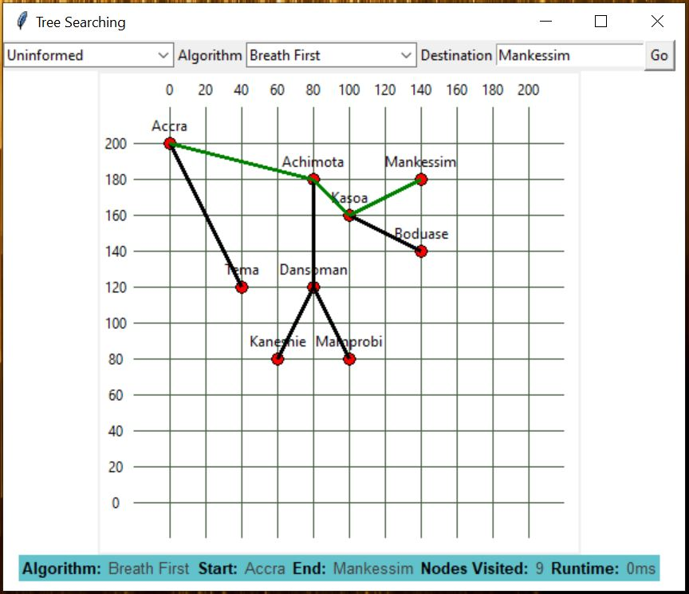
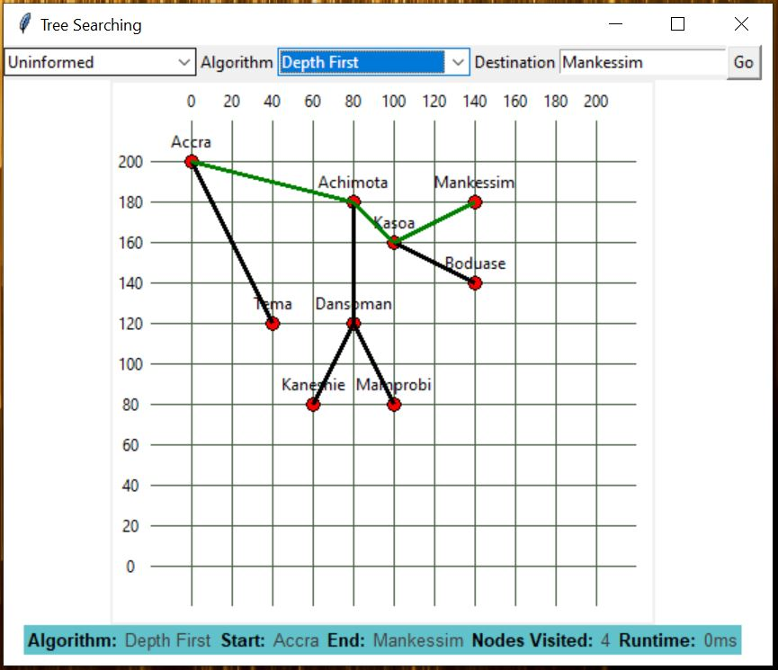
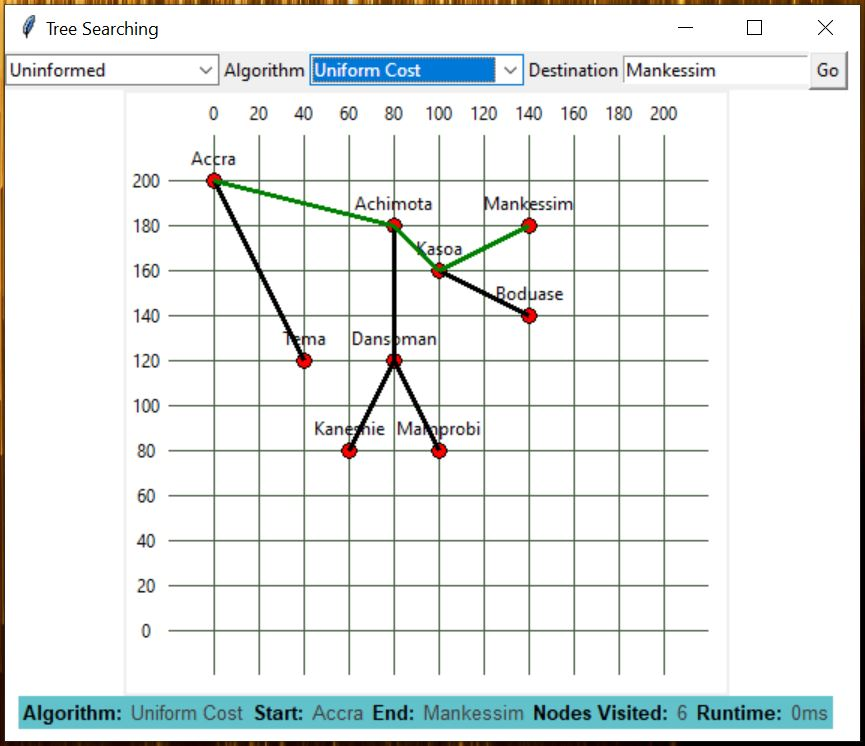

# Search-Algorithms-Python
This is a simple project with a collection of python scripts that demonstrate several informed and uninformed search stragegies.

# Screenshots
## Main menu


## Breath first search


## Depth first search


## Uniform cost search


# How to run
The application can be started by running the [main.py](main.py) script

```console
foo@bar:~$ python main.py
```